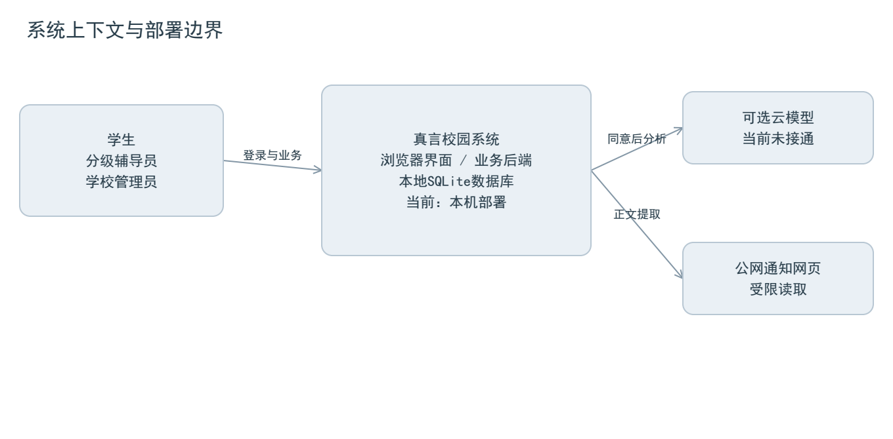
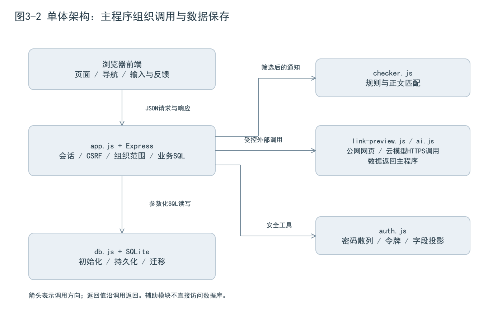
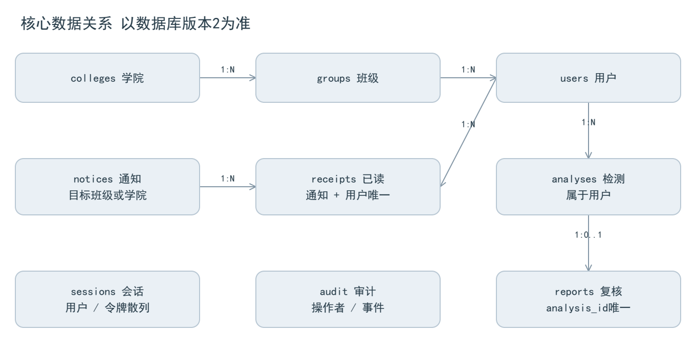
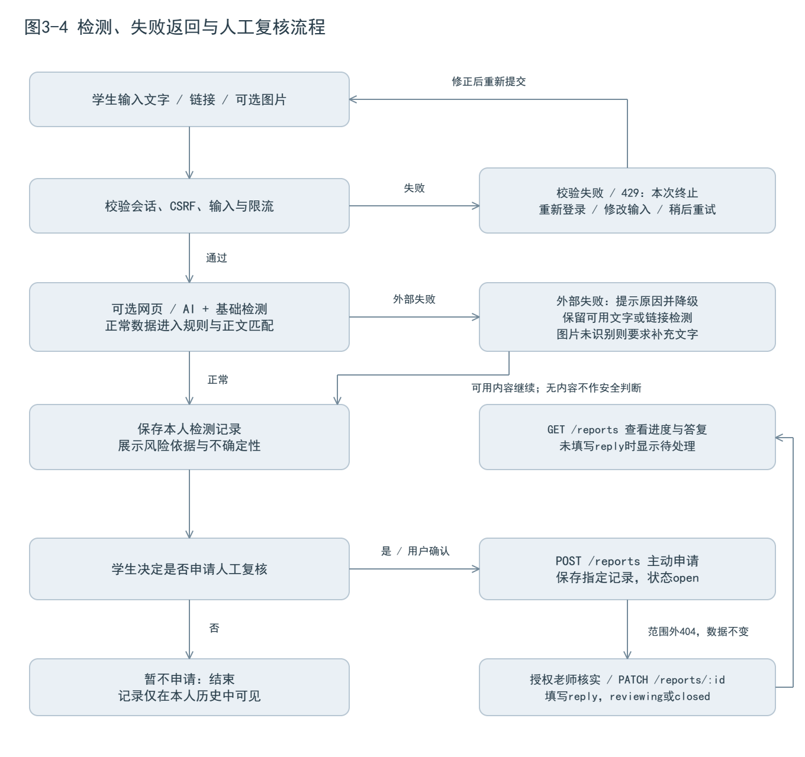
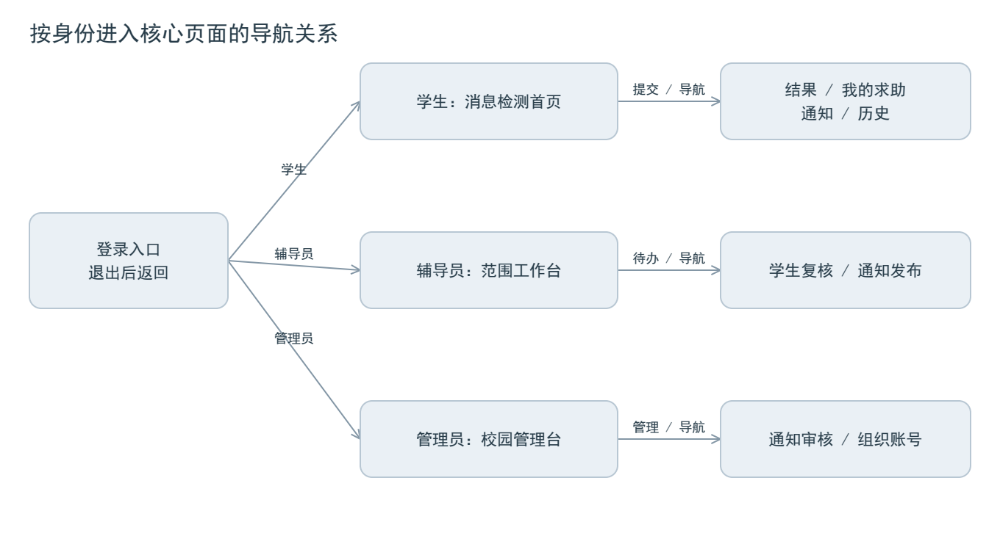
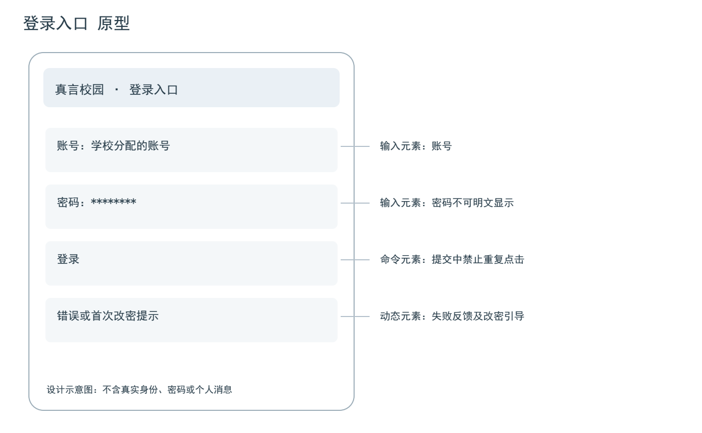
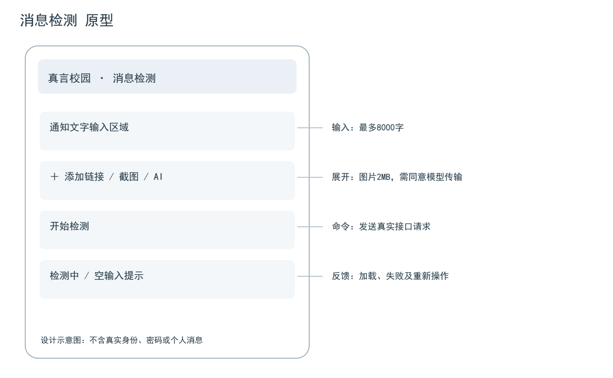
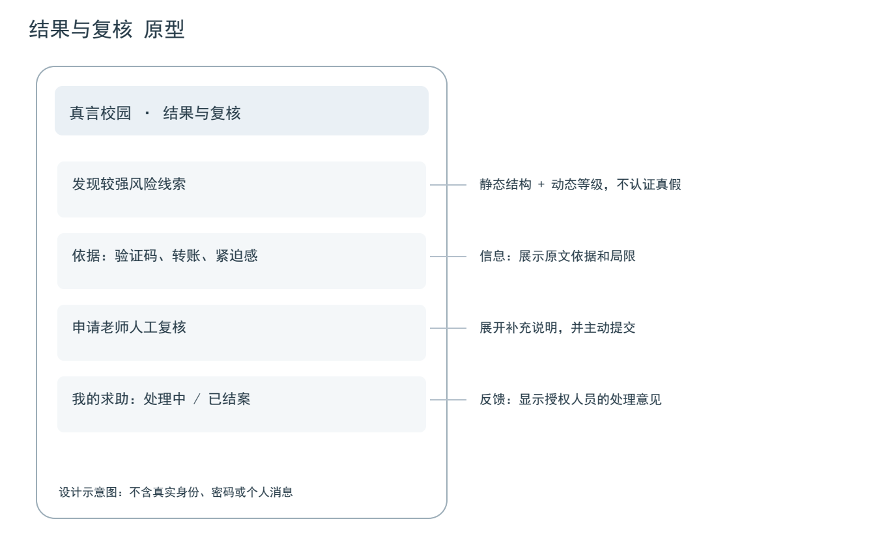

### 3.1 设计输入与追踪记录

本实验以实验2需求说明V1.1（2026年9月27日）的FR01—FR08、NFR01—NFR04及A1—A5为设计输入，选定“学生登录—提交消息—查看并保存检测结果—主动申请复核—授权老师核实答复—学生查看进度”作为核心流程。通知发布与组织管理为该流程提供可信正文和授权范围；AI是可关闭的辅助能力。

本报告是对当前方案的设计整理及修订。三张原型用于说明页面结构和后续调整，不作为编码前已完成设计的时间证据。当前交付中未找到可核验的早期草图或原型版本；原型时序是否符合课程要求，应由教师结合实际过程确认，不补造早期日期或提交记录。

表3-0 核心流程的用户故事。编号沿用实验2表2-5，具体设计与验收统一落入表3-1。

| 需求 / 优先级 | 用户故事 | 在核心流程中的作用 |
| --- | --- | --- |
| FR01 / P0 | 作为学生，我希望安全登录，以便查看本人数据 | 进入流程并隔离个人记录 |
| FR02 / P0 | 作为学生，我希望核对消息，以便了解风险依据 | 输入、检测、保存与查看结果 |
| FR03 / P0 | 作为学生，我希望核对官方正文，以便寻找来源 | 只匹配本范围已发布通知，保留发送者核实提醒 |
| FR04 / P0 | 作为学生，我希望请求人工复核，以便获得校方答复 | 主动共享指定记录，查询进度和答复 |
| FR05 / P0 | 作为辅导员，我希望只处理管理范围内申请，以便履行职责并保护其他学生的隐私 | 按班级、学院或全校范围核实和处理 |
| FR06 / P0 | 作为管理员，我希望控制发布与人员范围，以便让信息经过授权并准确送达 | 维护账号范围、审核全校通知 |
| FR07 / P1 | 作为学生，我希望理解截图与长消息，以便减少阅读困难并找到需核实的内容 | 同意后调用模型；失败可回到文字检测 |
| FR08 / P1 | 作为用户，我希望看到适合身份的界面，以便快速找到本角色的主要任务 | 按身份组织首页、导航和反馈 |

表3-1 需求与设计双向追踪表。

| 需求 | 设计任务、模块与数据 | 接口及界面 | 对应图文 | 验收条件 |
| --- | --- | --- | --- | --- |
| FR01 登录 | app.js会话与CSRF；auth.js散列；users、sessions | POST /auth/login；登录及改密页 | 图3-2、3-6；表3-6 | 有效账号进入角色首页；未登录401、CSRF无效403；不返回密码散列 |
| FR02 检测 | app.js校验和保存；checker.js规则；analyses | POST /analyze、GET /analyses；检测、结果及历史页 | 图3-2、3-4、3-7、3-8 | A2返回high与风险依据；A3信息不足不认证安全；A4返回400且不保存 |
| FR03 核对 | noticeScope限制正文来源；checker.js匹配；notices、receipts | GET /notices、POST /analyze；通知列表与检测结果 | 图3-3、3-4、3-8 | A1同文返回official并提醒核实发送者；范围外或未发布通知不得参与 |
| FR04 复核 | app.js维护申请及答复；reports、analyses | POST及GET /reports；结果展开、我的求助 | 图3-3、3-4、3-8 | A5由open到closed并可读reply；重复申请409；个人历史不会自动共享 |
| FR05 范围 | groupScope校验读取和处理；colleges、groups、users | GET /groups、PATCH /reports/:id、PATCH /users/:id；分级工作台 | 图3-2、3-3、3-5；表3-6 | 跨学院处理被拒且数据不变；管理员变更账号范围后旧会话失效 |
| FR06 审核 | app.js组织管理与审批；users、notices、audit | /users、/manage/notices；组织账号及审核页 | 图3-3、3-5；表3-6 | 需审批的通知先为pending；管理员批准后可见；辅导员不能审批 |
| FR07 AI | ai.js受控HTTPS调用和结构校验；结果随analyses保存 | POST /analyze，useAI；检测页展开选项 | 图3-1、3-2、3-4、3-7；表3-4 | 主动同意且配置可用才调用；模型失败提示降级；程序校验格式、人工核对内容 |
| FR08 易用 | public/app.js角色布局、style.css移动布局 | 身份首页、底部导航及展开表单 | 图3-5至3-8 | 登录进入本角色首页；主操作首屏可达；次要输入按需展开 |
| NFR01 安全 | 会话、CSRF、服务端范围校验；敏感数据保护 | 登录、检测、复核、管理接口及角色页面 | 图3-2、3-3；表3-4至3-6 | 检查未登录、伪造CSRF、跨班跨学院请求被拒，数据不变 |
| NFR02 可靠 | SQLite持久化与在线备份；外部失败降级 | 检测、历史、复核接口及失败提示 | 图3-2至3-4；3.4节 | 保存后重启仍可读；模拟超时、格式错误、额度耗尽，基础流程可用 |
| NFR03 可用 | 390像素宽移动布局；加载、空数据、错误反馈 | 登录、检测、结果及求助页 | 图3-5至3-8；3.5节 | 按实验2的N1—N4走查，再记录真实用户任务障碍；不虚填可用性评价 |
| NFR04 性能 | 单校单进程；限制并发与外部等待 | 纯文字POST /analyze；检测中反馈 | 图3-2、3-7；本节性能方法 | 关闭AI及网页提取，95%的成功请求在2秒内完成；目标尚未实测 |

表内接口统一省略/api前缀，完整方法和字段见表3-6。每个图的说明同时标明FR或NFR编号，从需求可以定位设计，从图件也可回查需求；未另建重复的追踪表。

性能验证沿用实验2V1.1：在同一测试机记录Node版本、机器配置和数据量，关闭AI与网页提取，按合法节奏测20次顺序请求，统计成功率及95%分位耗时；另做并发试验并区分成功、429拒绝和其他错误。每用户每分钟6次、每用户最多1个进行中检测、全局最多20个进行中任务是限流设计，不能当成吞吐量或“已达到2秒”的证据。本次不生成未经执行的性能测量结论。

普通程序负责可验证的权限与业务状态；模型只产生待验证的内容说明，不能调用管理接口、改变数据库权限或决定通知发布。

### 3.2 技术选型与ADR

表3-2 候选技术比较。以单人课程项目、已有代码和后续维护成本为依据。本人目前较熟悉HTML、CSS和JavaScript，能够继续维护本项目的原生前端与Node.js代码；Express、SQLite、权限和异步接口仍需结合源码与测试持续验证，不把“能使用”写成“完全熟练”。

| 比较维度 | Node.js＋Express＋SQLite＋原生前端 | Spring Boot＋Vue＋MySQL | 静态页面＋浏览器存储 |
| --- | --- | --- | --- |
| 本人熟悉程度与学习成本 | HTML、CSS、JavaScript较熟悉；Express、SQLite、会话和SQL仍需边做边验证，已有代码可沿用 | Java、Spring、Vue和MySQL不是当前主要熟悉方向，需额外学习与配置 | 页面结构较直观；仍需学习浏览器存储、事件和状态，不能实现可信后端权限 |
| 实现成本 | 前后端同语言、单进程、单数据库文件；页面增多后手写渲染维护成本增加 | 前后端构建、服务与数据库分别维护；课程规模下配置负担较高 | 最快做单机原型；多人复核与审批仍需补后端，后续重做成本高 |
| 框架生态 | Express中间件、Node内置测试和SQLite接口；需自行规范模块边界 | Spring生态与Vue组件较完整；工具多但学习面较广 | 标准Web技术与静态托管即可；缺少可信服务端职责 |
| AI接入 | 服务端fetch调用兼容HTTPS接口，密钥留在后端，统一校验与超时降级 | 后端HTTP客户端可实现相同能力，但需另写适配和部署配置 | 浏览器直连不宜保存服务密钥，正式使用需另建代理服务 |
| 测试 | node:test验证规则和接口，临时SQLite隔离数据；模型通过模拟响应验证失败路径 | 可用JUnit、MockMvc及前端测试工具；需维护多套测试环境 | 易检查展示和输入；不能验证真正的多用户服务端授权 |
| 运行环境 | package.json约束Node >=24.15.0且<25；本机或单台服务器，数据目录需可写 | 需匹配的JDK、Node构建环境与MySQL服务；运维组件更多 | 现代浏览器与静态服务器；数据局限在浏览器，跨设备不可靠 |

ADR-01（语言与框架）：问题是单人维护前后端和保证权限闭环。比较表3-2三种方案后，选择JavaScript、Express 5及HTML/CSS，沿用现有项目并减少构建环节。app.js组织接口，checker.js、ai.js等提供辅助能力；不足是接口和渲染文件偏大、组件复用弱，需补足本人对异步流程、输入边界和权限代码的理解。扩展页面前按业务拆分，而不是单凭文件已存在认定技术已掌握。

ADR-02（数据保存）：问题是多用户共享、记录持久化和低运维成本。候选为浏览器存储、SQLite和MySQL；浏览器存储无法作为可信共享数据源，MySQL需要额外服务维护，因此当前采用Node内置SQLite接口，开启WAL、外键并使用单实例。优点是初始化和文件备份简单；不足是同步查询可能阻塞事件循环、写并发及多副本扩展受限。出现跨服务器部署需求时迁移到服务型关系数据库，并重新验证事务、备份和连接管理。

ADR-03（体系结构及关键依赖）：问题是保证“检测—复核—答复”在小规模部署下容易调试和验证。比较纯前端、同源单体及前后端分离服务后，采用浏览器客户端与同源单体后端；统一处理会话、范围、保存和外部调用。不足是部署与故障集中在单实例，不能据此承诺高可用。基础版本不引入微服务、消息队列或Agent调度。

模型服务作为关键外部依赖，由ai.js经HTTPS调用。与实验2保持一致，拟选兼容Chat Completions的qwen3-vl-flash，配置须通过实际账号和地域验证，当前不宣称真实模型已接通。不可用、超时、额度耗尽或结构错误时回退到规则检测与人工复核；仅图片识别失败时要求补充文字，不输出截图安全结论。更换服务商前验证视觉输入、extractedText/summary/concerns字段、超时和隐私策略。25秒模型超时与账号每日次数限制不等于费用封顶；预算控制和实际效果评测沿用实验2V1.1。

### 3.3 系统上下文与模块结构



图3-1说明（FR01—FR07、NFR01—NFR02）：学生、分级辅导员和管理员通过浏览器访问本系统；系统边界包括前端、后端、网页提取适配器和SQLite。公网网页及云模型是外部依赖，均经后端访问。当前按本机单实例描述，云模型接通情况未在本次验证；未来可放到学校或云服务器，数据库不直接向公网开放。



图3-2说明（FR01—FR07、NFR01—NFR02、NFR04）：界面通过JSON接口访问app.js中的Express业务入口。app.js执行会话、CSRF、组织范围及输入校验，直接使用db.js返回的SQLite连接查询通知、保存检测、维护复核和审计。checker.js接收已经筛选的通知数据并返回规则结果；auth.js提供散列、随机令牌、密码验证等工具；网页及模型模块返回数据，不直接读写数据库。该方案是职责划分的单体，不宣称已有独立的控制器/服务/仓储三层目录。图中箭头表示调用或读写方向，返回值由原调用链接收。

表3-3 模块及职责。

| 模块 | 职责与主要依赖 |
| --- | --- |
| public/index.html、app.js、style.css | 页面容器、哈希导航、表单请求、按身份渲染 |
| app.js | Express接口、输入校验、会话及CSRF、组织范围、业务SQL和审计；调用辅助模块 |
| auth.js | 密码散列和验证、令牌生成及散列、安全的用户字段投影；不直接保存会话 |
| checker.js | 规则评分、正文匹配与不确定性提示 |
| link-preview.js | 公网地址验证、DNS与跳转检查、有限HTML正文提取 |
| ai.js | 可选模型请求、超时、JSON字段校验与长度裁剪 |
| db.js | 建表、外键、WAL、版本1到版本2迁移 |
| scripts/backup.mjs | SQLite在线备份；服务器日志与audit辅助定位 |

表3-4 职责边界。

| 参与方 | 负责 | 不负责 |
| --- | --- | --- |
| 用户 | 提供原文、同意模型传输、主动申请复核 | 不自行决定后台访问范围 |
| 普通程序 | 权限、匹配、评分、保存；检查AI字段、类型、长度与请求超时 | 格式校验不能证明内容真实；不把“无命中”转换成“安全” |
| 模型 | 识图、摘要、可疑要求说明 | 不认证学校身份、不写入审批结论 |
| 网页提取工具 | 受限地读取公网页面正文 | 不执行脚本、不登录、不访问内部网络 |
| 授权工作人员 | 对主动申请的内容核对学校渠道，复查AI说明与原文，给出处理意见 | 不读取未提交复核的他人个人检测历史，不把AI摘要当校方证明 |

AI结果的检查分两层：普通程序拒绝无效结构并限制文本长度；用户先对照原消息阅读，涉及身份、付款或缺少证据的结论由授权工作人员经已知渠道复核。模型输出和网页正文均按不可信数据处理，不执行其中指令。课程评测采用实验2的A2、A3、A5及脱敏样例计划，由作者核对事实与风险点；尚未执行的评测不填写通过率。

### 3.4 数据、接口与流程设计



图3-3说明（FR01—FR06、NFR01—NFR02）：学院包含多个班级；班级关联学生及班级辅导员；院级辅导员通过college_id取得范围，校级通过层级取得全校范围。一次分析最多有一个复核申请；通知和用户通过receipts形成多对多关系。图保留核心关系，通知作者、复核处理人、学院范围等约束由表3-5补充。原始图片不保存，提取文字、摘要和分析结果属于持久化敏感数据。

表3-5 核心数据约束。

| 数据表 | 关键字段与约束 |
| --- | --- |
| colleges / groups | id主键、name唯一；groups.college_id可空以兼容旧班级 |
| users | username不区分大小写且唯一；role为student/counselor/admin；counselor_level为class/college/school；group_id及college_id外键限定组织；password_hash保存加盐散列 |
| sessions | 仅保存token_hash，关联用户、csrf及expires_at；Cookie含随机令牌 |
| notices | title、content、issuer；author_id引用users；group_id或college_id限定范围；状态为pending/published/rejected/withdrawn；目标组合还由接口校验 |
| receipts | notice_id与user_id复合主键，防止重复计数 |
| analyses | user_id、group_id、input_text、link、result_json及创建时间；历史归本人 |
| reports | analysis_id唯一且外键删除级联；状态open/reviewing/closed；note保存申请说明，reply保存意见；handler_id引用users，可空表示未处理 |
| audit | actor_id、action、target_id、created_at，不保存密码或完整输入正文 |

敏感数据包括会话令牌、密码散列、用户输入、提取文字和复核意见。生产Cookie使用Secure，API响应禁止缓存；浏览器Service Worker只缓存应用外壳。SQL使用绑定参数；前端插入文字先转义。AI密钥通过服务端环境配置读取，不写入报告或客户端。

表3-6 主要接口设计（路径均带/api前缀）。

| 方法与路径 | 提供方 / 调用方及用途 | 输入与成功输出 | 失败情况 |
| --- | --- | --- | --- |
| POST /auth/login | 鉴权 / 登录页 | username、password；user、csrf和Cookie | 401凭据无效，429频率限制 |
| POST /auth/logout | 鉴权 / 退出按钮；撤销当前会话 | 无业务参数；ok=true，清除Cookie | 401未登录；403缺少有效CSRF |
| GET /notices | 通知 / 列表或核对流程 | 无业务输入；本范围已发布通知数组 | 401未登录 |
| POST /analyze | 检测 / 学生表单 | text、link、image、useAI；id、level、status、reasons | 400空输入或格式错误；429限流 |
| GET /analyses | 检测记录 / 历史页；查看本人历史 | 无业务参数；最近100条本人记录，含id、text、result和时间；无数据为[] | 401未登录；他人记录不纳入查询 |
| POST /reports | 复核 / 检测结果页 | analysisId、note；新申请id | 404非本人记录，409重复 |
| GET /reports | 复核 / 我的求助及工作台；读取进度答复 | 无业务参数；最近200条本人或授权范围申请，含status、reply、updatedAt；无数据为[] | 401未登录；范围外申请不纳入查询 |
| PATCH /reports/:id | 复核 / 辅导员工作台 | status、reply；ok=true | 404范围外，400无有效意见 |
| POST /manage/notices | 通知 / 工作人员 | 标题正文与范围；id、status | 403跨范围，400无效目标 |
| PATCH /manage/notices/:id | 审批 / 管理员 | 状态及驳回说明；ok=true | 非管理员不得审批 |
| POST /users；PATCH /users/:id | 管理 / 组织账号页 | 角色、层级、班级或学院；id或ok | 400范围无效；变更层级撤销会话 |

鉴权、检测和复核等接口均由app.js路由提供，上表按业务职责标注提供方。除登录外须携带有效会话；写操作还须CSRF令牌，权限不足按具体接口返回403或404。GET的空数组是正常空数据，不表示请求失败；报告示例使用脱敏占位字段，不包含真实Cookie、密码或令牌。

代码3-1 正常请求示例。请求前已登录，实际Cookie和CSRF省略，不可照抄占位值用于真实请求。

```json
POST /api/analyze
{"text":"请立即提供验证码并转账","useAI":false}

HTTP 201（输出字段节选）
{"status":"risk","level":"high","reasons":["要求提供验证码或密码","涉及转账或付款","制造紧迫感"]}
```

代码3-2 错误请求示例。

```json
POST /api/analyze
{"text":"","link":"","image":""}

HTTP 400
{"error":"请填写文字、链接或上传截图"}
```

代码3-3 复核答复读取示例（字段节选）。老师核实并结案后，学生重新读取同一申请；id和时间为示意值，不是线上操作记录。

```json
GET /api/reports
HTTP 200
[{"id":"示例申请编号","status":"closed",
  "reply":"已通过已知渠道核实，请勿向陌生人提供验证码或转账。",
  "updatedAt":"2026-09-27T08:00:00.000Z"}]
```



图3-4说明（FR01—FR05、FR07、NFR01—NFR02）：非法输入在保存前终止并允许修改；网页及模型失败时明确提示，能处理的文字继续基础检测。结果展示后由学生决定是否申请，未申请的历史保持本人可见。申请时通过POST /reports保存指定记录；授权老师经可靠渠道核实并写入reply；学生通过GET /reports查看原申请的状态和答复。范围外处理返回404，数据不变；复核未结案时禁止删除关联分析，防止证据在处理中消失。流程图明确画出失败返回、人工选择及答复方向。

### 3.5 页面结构和三张关键原型

导航结构：登录后学生进入消息检测页，底部为检测、通知、学习、记录及更多；辅导员进入班级/学院/全校工作台，主要入口为待办复核和通知发布；管理员进入校园管理台，主要入口为通知审核、复核和组织账号。品牌入口返回角色首页，底部导航切换页面，退出按钮注销会话；首登改密时仅开放个人设置。



图3-5说明（FR01、FR04—FR06、FR08、NFR03）：登录后按身份进入不同首页，再通过底部导航或待办入口到核心页面；学生检测后在结果区申请复核，并从“我的求助”追踪答复。角色首页可由品牌入口返回，退出登录回到入口；首登改密时先进入个人设置。图中合并了同一角色的次要页面，不表示所有用户拥有相同权限。



图3-6说明（FR01、FR08、NFR01、NFR03）：静态元素为品牌和说明；输入元素为账号与密码；命令元素为登录按钮；动态反馈为错误消息、提交中状态及首登改密引导。原型采用脱敏示意数据，不是早期开发时间点的截图。



图3-7说明（FR02、FR07—FR08、NFR03—NFR04）：核心文字框默认展示，最多8000字；链接最多2000字；截图限2MB的PNG/JPG/WebP。链接、图片和AI勾选按需展开，隐私说明可展开，防止信息堆积。未配置模型时截图入口和AI选项禁用；提交中按钮禁用并显示正在处理。三种输入全空时提示补充内容；失败保留可修改的输入，用户主动重试，避免自动重复提交。



图3-8说明（FR02—FR04、FR08、NFR02—NFR03）：结果页展示等级、依据、内容说明和局限；人工复核表单点击后展开。无匹配显示“暂无法判断”，而不是绿色安全认证；提交失败显示原因，用户可以返回修改输入；已申请时引导查看进度。本人历史为空时显示“暂无检测记录”并提供检测入口，复核列表为空时显示“暂无求助申请”；有申请但reply为空时显示待处理状态，不伪造老师答复。复核备注最多2000字，不默认传给模型。

### 3.6 一致性检查与版本记录

表3-7 设计检查。

| 检查点 | 发现的问题 | 调整与证据 |
| --- | --- | --- |
| 信息密度 | 统一页面对管理者和学生同样展示检测入口 | layouts按身份组织首页；学生检测、工作人员待办 |
| 权限颗粒度 | 单班辅导员无法覆盖学院与全校组织 | 数据库版本2加入学院与层级，后端groupScope统一判定 |
| 信任边界 | 正文一致可能被误认为发送者认证 | 结果文案保留来源核实提醒，AI不输出认证状态 |
| 复核隐私 | 若自动共享全部检测则扩大可见范围 | 仅主动申请的记录进入授权人员复核列表 |
| 数据范围 | 只隐藏按钮无法阻止伪造请求 | 服务端读写均检查范围；越权测试覆盖其他学院 |
| 需求对应 | 用户故事、图号与接口映射不完整 | 表3-0列故事，表3-1统一映射；图注反向标明需求编号；FR03补/analyze |
| 技术依据 | 只比较成本，个人熟悉程度及运行测试条件不清 | 表3-2补齐六个维度；ADR说明候选、理由和不足；个人经历不作未经确认的判断 |
| 调用关系 | 辅助模块被画成直接访问数据库 | 图3-2改为app.js负责SQL；auth.js及规则、AI模块按实际职责标注 |
| 答复闭环 | 接口表缺少历史和申请查询 | 表3-6加入GET /analyses、GET /reports及空数组语义；代码3-3展示答复字段 |
| 验收口径 | 性能描述没有跟随需求V1.1 | 表3-1同步95%请求在2秒内的目标和20次测量方法，不声称已经达标 |
| 图件表达 | 数据库连线穿过模型框，流程的失败与返回方向不清楚 | V1.2重绘图3-2、3-4，分开数据库读写与辅助调用，补充失败返回和人工选择 |
| 交付完整性 | 上传包缺正文源文件，重建脚本依赖原项目目录 | V1.2加入content3.md、依赖清单、文件校验清单及目录自适应，解压后可重建报告 |

检查范围包括实验2V1.1、实验3全部正文及图件，并对照app.js、db.js、auth.js、checker.js、ai.js、public/app.js与相关测试文件。2026年9月27日执行现有自动化测试，9项通过、0项失败，覆盖基础规则、账号权限、通知审批、复核、持久化、组织范围及模拟AI接口等；这不等于真实模型效果或性能实测。9月28日修订仅调整设计图件、文档及打包方式，不修改业务功能。学校SSO和公网部署不作为已验证成果。

表3-8 版本与交付记录。

| 项目 | 实际记录 |
| --- | --- |
| 本次设计版本 | V1.2；修订日期2026年9月28日；需求基线为实验2V1.1 |
| 个人仓库 | https://github.com/VeridantS/zhenyan-campus |
| 已有提交的适用范围 | f2c8050e8f50dcd350ffb5372970524cbf5df820为实验2初版上传证据，不能作为实验3提交证据 |
| 实验3本地成果 | 同名PDF、Word、Markdown；content3.md正文；figures下8张设计图的PNG与PDF；build-report3.py、requirements.txt和manifest.sha256；Word版尚未完成独立页面渲染验证 |
| 本次仓库状态 | 9月27日检查reports目录仅见实验2；9月28日再次访问超时，不能据此确认远端最新内容。本次提供本地上传包，实验3提交证据仍以真实远端记录为准 |
| 版本闭环方法 | 将上传包解压内容放入仓库reports/experiment3/并提交，再在仓库保存该次提交链接和实际文件清单；后续修改报告须另建提交，不复用实验2编号 |
| 过程证据限制 | 当前未取得编码前原型记录；保留本次真实修订日期，不伪造历史版本或设计基线Tag |

交付包中附文件清单和上传说明，架构、数据、流程、导航与三张原型均提供可读图件，重建文件用于追溯设计来源。上传成功后，应在GitHub打开实验3目录，核对报告、8组图件及源文件，再记录该次提交的完整链接。保存本地文件与提交个人仓库是两个状态，本报告不把待上传写成已完成。

## 4. 实验小结

本次将实验2V1.1的用户故事和验收条件落实到模块、数据、接口、图件与角色页面，并补齐从检测到查看人工答复的闭环。采用同源单体与SQLite可减少课程项目的部署成本，但同步查询、单实例扩展和大文件维护需要后续关注。规则、AI和鉴权工具返回数据，app.js统一校验业务权限并读写数据库；程序只能检查模型格式，内容事实仍需用户及授权工作人员核对。

修订中保留了三个真实边界：原型是当前设计整理，不能替代编码前记录；性能和模型效果是待执行的验证计划，不能用限流或模拟测试充当实测；本地交付不能替代远端仓库提交。后续重点是由本人解释关键取舍、完成实际设计文件上传，并按实验2验收计划验证结果。
